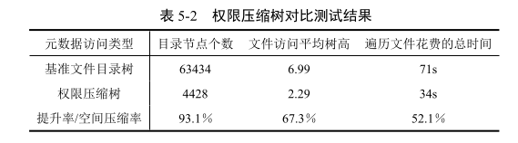

## compressed_tree.h和compressed_tree.h

1. void addDirNode(const std::string dir_path, TreeNode *cur, int st_mode, int parent_mode)：传入一个目录路径，当前节点指针，对应文件路径的权限信息，父节点的权限信息。最终完成节点的添加。
    
2. void deleteDirNode(const std::string dir_path, TreeNode *cur)：传入一个目录路径，当前节点指针，最终删除该路径的权限信息以及其子结点的权限信息。
    
3. TreeNode *getDirMode(std::string &dir_path, TreeNode *cur)：传入一个目录路径，当前节点指针，用来寻找某个文件在权限压缩树中对应的权限。
    
4. std::string getFileMeta(std::string &file_path)：传入一个文件路径，直接在hashmap中获取对应的元数据信息。
    
5. void setFileMeta(std::string &file_path, int mode)：传入一个文件路径，设置某个文件的元数据信息。
    
6. long long treeTraverse()：完成树的遍历。

## proper_tree.h和proper_tree.cpp

大部分函数与上面权限压缩树相同，区别主要是这里建立的是常见的文件目录树，访问文件元数据需要通过目录树逐级访问。

## main.cpp

首先需要运行python脚本获取整个系统的目录和文件的元数据信息。

测试文件。
1. 用获取的目录信息以及权限信息建立权限压缩树和普通的文件目录树。
2. 用获取的文件信息初始化权限压缩树中的文件hashmap，把文件信息当作正常的节点插入到普通的文件目录树中。
3. 统计权限压缩树压缩率。
4. 在权限压缩树遍历所有的文件，分为两步。首先访问权限压缩树获取权限信息，再去hashmap中获取对应的文件元数据信息。
5. 在普通的文件目录树遍历所有的文件，直接逐层遍历到文件节点并获取元数据信息。
6. 最终统计两次遍历用时信息，最终测试结果如下图：
